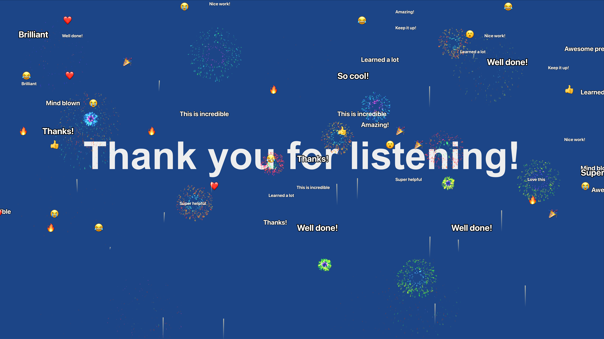
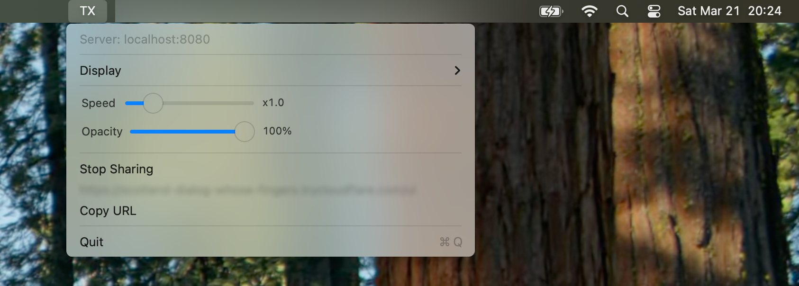
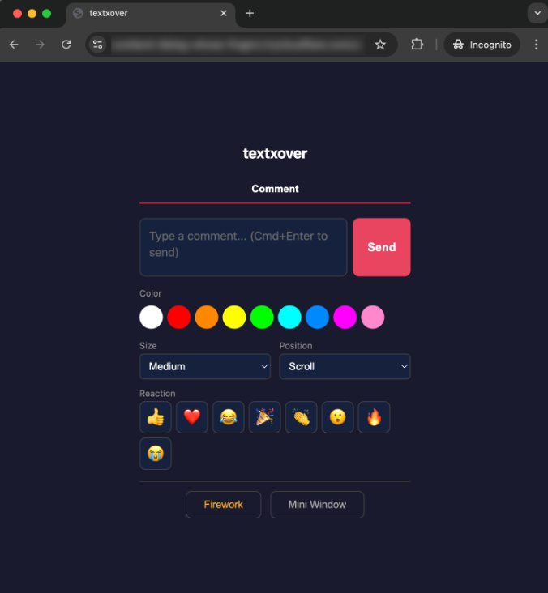
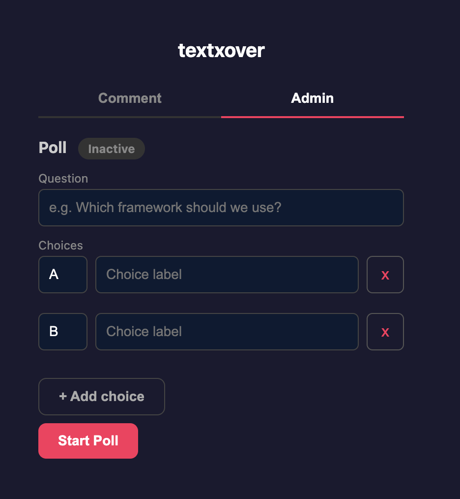
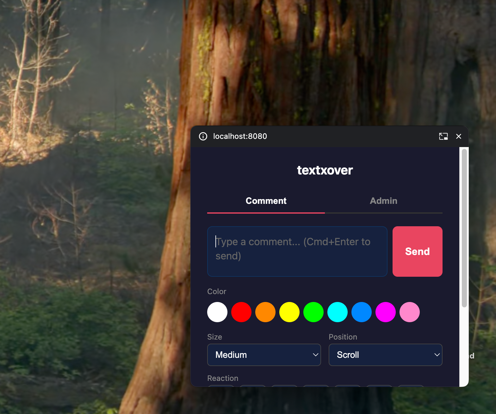

<p align="center">
  
</p>

<h1 align="center">textxover</h1>

<p align="center">
  A macOS overlay app that displays niconico-style scrolling comments, emoji reactions, and fireworks on your screen.<br>
  GPU-accelerated, visible in screen sharing, and shareable via one-click tunnel.
</p>

<p align="center">
  
</p>

<p align="center">
  
  
</p>

<p align="center">
  
  
</p>

## Features

- **Scrolling comments** — right-to-left, top-fixed, or bottom-fixed
- **Emoji reactions** — one-tap reactions visible on the overlay
- **Fireworks** — GPU-computed particle effects
- **Transparent overlay** — always on top, mouse-transparent, visible in screen sharing
- **GPU-accelerated** — wgpu/Metal rendering at 60fps
- **HTTP API** — send comments and effects via `localhost:8080`
- **WebUI** — browser-based comment form at `/ui` with color, size, and position options
- **Live polls** — host can start polls, participants vote from WebUI, results rendered in real-time
- **Mini Window** — Document Picture-in-Picture mode so you can comment while on another tab
- **Shareable** — one-click cloudflared tunnel to share the WebUI with others (auto-downloaded on first use)
- **Menu bar app** — speed/opacity sliders, display selection, no Dock icon

## Requirements

- macOS (Apple Silicon or Intel)
- Rust toolchain
- [just](https://github.com/casey/just) command runner

## Quick Start

```bash
# Install just (if not installed)
brew install just

# Build and run
just run
```

The app starts in the menu bar as **TX**. A server runs at `http://localhost:8080`.

## Sending Comments

### Via curl

```bash
curl -X POST http://localhost:8080/comment \
  -H 'Content-Type: application/json' \
  -d '{"text":"Hello!", "size":"big", "type":"scroll"}'
```

### Via WebUI

Open `http://localhost:8080/ui` in your browser.

### Via Google Meet extension

A companion Chrome extension can intercept Meet chat messages and forward them to textxover automatically.

## Sharing the WebUI

1. Click **TX** in the menu bar
2. Click **Share WebUI...**
3. On first use, cloudflared is downloaded automatically (~38MB)
4. A public URL is generated and copied to your clipboard
5. Share the URL with participants — they can send comments from their browser

## HTTP API

| Method | Path | Description |
|--------|------|-------------|
| POST | /comment | Send a comment |
| POST | /effect | Trigger an effect (firework) |
| POST | /config | Update settings |
| GET | /status | Get current state |
| GET | /ui | WebUI |

### POST /comment

```json
{
  "text": "Hello!",
  "color": "#FF0000",
  "size": "big",
  "type": "scroll"
}
```

- `text` (required) — comment text
- `color` (optional, default `#FFFFFF`) — hex color
- `size` (optional, default `medium`) — `big`, `medium`, `small`
- `type` (optional, default `scroll`) — `scroll`, `top`, `bottom`

### POST /effect

```json
{
  "type": "firework",
  "x": 0.5,
  "y": 0.5
}
```

### POST /config

```json
{
  "speed": 1.5,
  "opacity": 0.9
}
```

All fields are optional (partial update).

## Build Commands

```bash
just build-rust    # Build Rust dylib
just build-swift   # Build Swift binary (includes Rust build)
just bundle        # Create .app bundle
just run           # Build + run
just clean         # Clean build artifacts
```

## License

MIT
